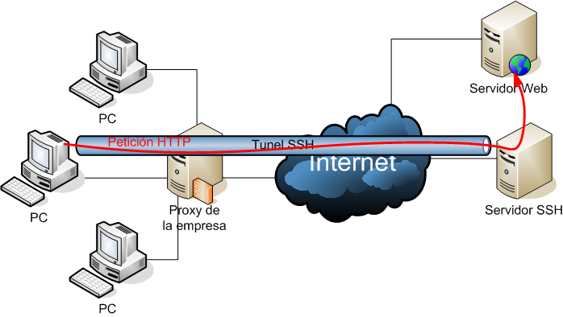
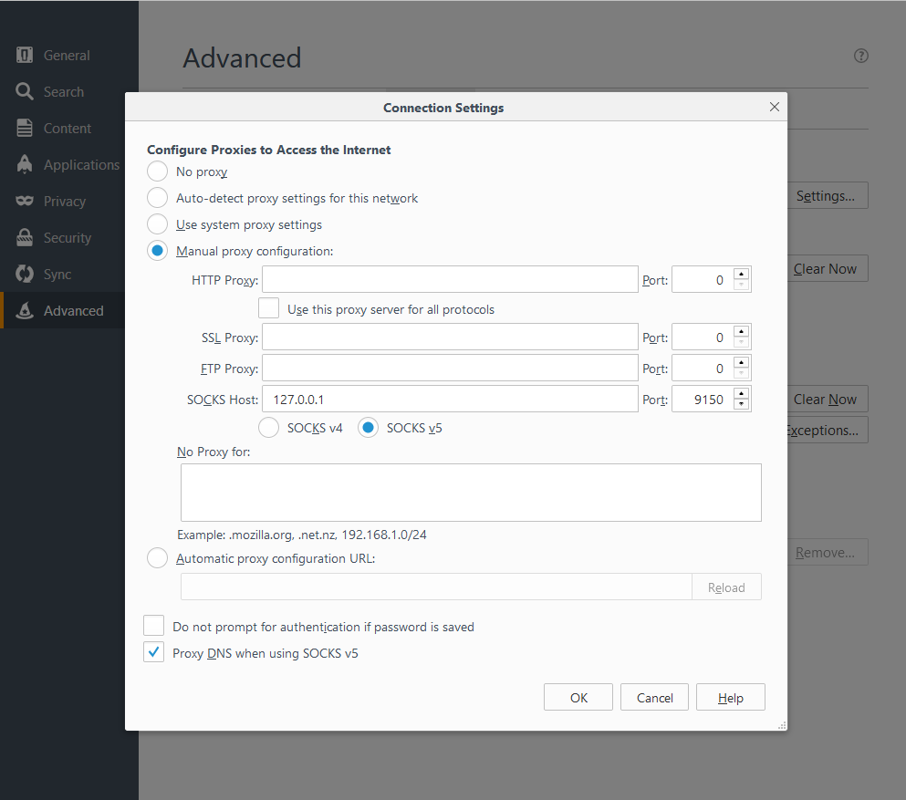
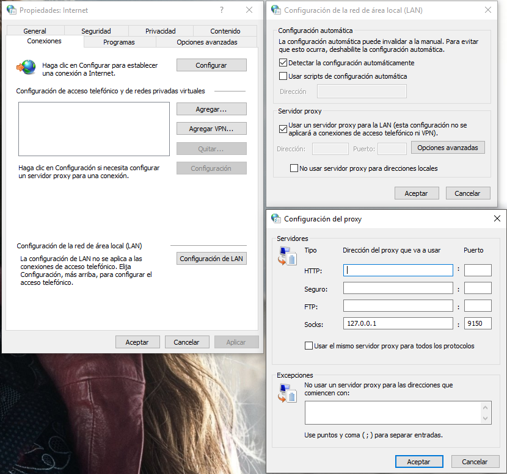
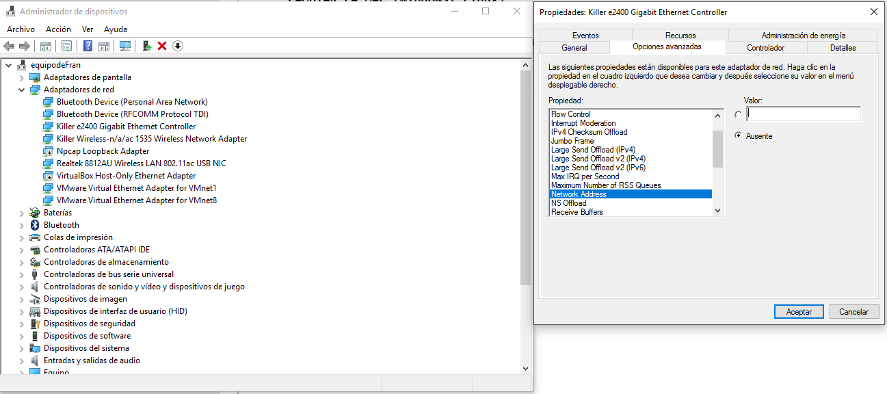

# CAPITULO 1. Terminal

**apt-get install terminator**
Usar el software Terminator = nos permite dividir la terminal de una manera muy práctica

### MANEJO BASICO TERMINAL

**Ifconfig** = muestra los datos de red, ip, mascara, broadcast...

**pwd** = ruta donde nos encontramos

**cd “directorio”** = nos mueve a ese directorio

**cd ..** = nos mueve al directorio anterior

**ls** = nos muestra los archivos y directorios donde nos encontramos

**ls -all** = muestra más detalles de los archivos y directorios, como permisos, tamaño, fecha de creación, etc...

**ls -all *.txt** = filtraría los txt

**grep -i “filtro”** = nos muestra la línea con la palabra a filtrar

**echo “información que queramos introducir” > nombrearchivo.txt** = crea un archivo .txt con esa información

**cat** = para leer un fichero

**nano** = para editar un fichero

**rm** = borrar archivo

**mkdir “directorio”** = crear directorio

**history** = para ver todos los comandos que hemos usado 

**rm -R “directorio”** = elimina un directorio

**cp “archivo para copiar” “nombre del archivo copiado”** = copiar archivos


### GESTION DE PROCESOS, PERMISOS Y BUSQUEDAS

#### PROCESOS

**ps** = para ver los procesos que están corriendo en el sistema (entorno de usuario)
**ps -all** = todos los procesos 
**“nombre del CMD” &** = dejar el proceso en segundo plano
**kill -9 “PID”** = para matar un proceso, el -9 es para forzar el cierre del proceso
top = ver los procesos y su consumo
**killall -9 “proceso”** = para matar varios procesos 
**bg** = para ver lo que tenemos en background
**fg** = para para volver al proceso que está en el background
**Cntrol+C** = termina el programa **Cntrol+Z** = lo mata  Cntrol+D = lo deja tal cual (background)

#### PERMISOS

**r = read 4   w = write 2   x = execute 1**

  - Los archivos están formados por 9 bits 3 grupos de tres, ejemplo: -rwx rwx rwx = 777
  
  - El primer grupo de 3 pertenece a los permisos del usuario actual, el segundo al grupo, y el tercero a otros usuarios del sistema.

**sudo su** = nos convierte en usuarios root con sus privilegios
**chmod 777 “archivo”** = para darle todos los permisos 
**chmod +rwx “archivo”** = daría los permisos “r w x” a los 3 grupos usuario, grupo y otros usuarios (777)

#### BUSQUEDAS

**grep -r “búsqueda” /** = nos buscaría todo lo que contuviese la palabra desde el directorio raíz
**locate “palabra a buscar”** = busca en la terminal la palabra
**updatedb** = actualizar la db
**whereis “palabra a buscar”** = busca la ruta

### RED E INSTALACION DE SOFWARE

**useradd -m “nombre usuario”** = crea un usuario nuevo
**passwd “nombre password”** = modifica el password
**usermode -a -G sudo “usuario”** = le da permisos de root

#### RED

**ping** = probar conexión entre dos ips

**netstat -ano** = indica que puertos y servicios están abiertos

**service ssh start** = inicia el servicio ssh

**service ssh status** = nos muestra el estado del servicio

**service ssh stop** = nos para el servicio ssh

**ssh “nombreusuario@IP”** = para conectarnos a un servicio ssh

**exit** = para salir de un servicio ssh

**service** = muestra todos los servicios que podemos iniciar (como el ssh anteriormente)

**service “servicio” start** = iniciar servicio

**service “servicio” stop** = parar servicio

**service “servicio” status** = ver el estado del servicio

#### INSTALACION DE SOFTWARE

**apt-get install “repositorio”** = instalaría el repositorio elegido

**dpkg -i “archivo.deb”** = para instalar archivos .deb

**./config | make | makeinstall** = para archivos ya descargados


### INFORMACION DEL SISTEMA 

**date** = fecha

**cal** = calendario

**uptime** = tiempo que lleva el sistema habilitado

**w** = que usuarios están ahora conectados al sistema

**whoami** = para saber que usuario somos

**finger “usuario”** = información del usuario

**uname -a** = información del sistema

**cat /proc/cpuinfo** = nos dará información del equipo (CPU)

**cat /proc/meminfo** = nos dará información de la memoria

**free** = uso de la memoria

**df** = memoria disponible

**man “comando”** = nos dará información del comando , como lanzarlo, como usarlo, etc. . .


### SCRIPS

#### DOMINIOS Y SUBDOMINIOS

**wget “url”** = descarga el código fuente de esa url

**grep “href=” “url”.html** = buscaría dentro de ese HTML los href
**| cut -d”/” -f3** = nos mostraría añadiendo a lo anterior lo que se encuentre entre el símbolo 
indicado

**| grep “\.”** = para filtrar aun filtrando el punto

**| sort -u** = nos ordena los dominios por orden y no nos replica los repetidos

**\> “nombre del archivo”.txt** = nos guardaría la terminal en un txt

### HOST

**Host “dominio”** = nos da la ip de ese dominio

**For dom in $(cat “nombre del archivo”.txt); do host $dom; done** = este scrip nos daría el comando host de cada dominio que estuviese en el txt que sacamos anteriormente 

**| grep “has address”** = nos filtraría los que en su línea tuviesen “has address”

**| cut -d “ “ -f4** = nos mostraría a partir del espacio 4º (en este caso solo las ips)

**; done** = nos iría mostrando el proceso

# CAPÍTULO 2. Evitar que nos identifiquen como origen de la conexión

Recursos extras:
[Mailinator](https://www.mailinator.com/) = página web para usar correos públicos
[Recivefreesms](https://smsreceivefree.com/) = para recibir mensajes móviles online

## NOCIONES BASICAS

**Tunelización de protocolos** = meter un protocolo dentro de otro.

Por ejemplo si quisiéramos utilizar un protocolo SSH pero en nuestra empresa solo permiten el tráfico HTTP podemos tunelizar el protocolo SSH a través del tráfico HTTP.
Crearíamos un túnel HTTP y por ese túnel lo usaríamos para utilizar el protocolo SSH.


**Servidores proxy** = sistema que funciona como un punto intermedio (*middleaware*).

Los servidores proxys son servidores que se utilizan como intermediarios, en el ámbito de la informática un servidor proxy es un servidor que utilizamos para escondernos, si nosotros estamos utilizando un proxy cuando el servidor victima este mirando, vera la dirección del servidor proxy.

Una técnica utilizada es el **encademiento de proxys**, quiere decir que encadenamos varios proxys para que sea más difícil ser rastreados ya que pasamos por todos ellos para poder conectarnos, si utilizamos por ejemplo un proxy de China y otro de Estados Unidos por ejemplo tendrán un enfrentamiento geopolítico y estos países no colaborarían entre ellos.


**VPN virtual prívate network** = conexión punto a punto cifrada.

Todo nuestro tráfico se va a cifrar desde nuestro punto hasta el servidor VPN, así no podrán interceptar el tráfico ya que va cifrado, recomendable por ejemplo en wifis públicas.
En el ámbito del hacking las VPN se usan para conectarnos desde servidores VPN de diferentes países.


### TOR

#### NAVEGAR DE FORMA ANONIMA

TOR es una abreviatura de *The Onion Project*, un proyecto que busca el poder crear una red de comunicaciones distribuida de baja latencia por encima de la capa de internet de manera que nunca se revelen los datos de los usuarios que la utilizan, manteniéndose así como una red privada y anónima.

Para configurar Google Chrome con anonimato del servidor Thor lo único que hay que hacer es añadirle en su proxy el servicio que ha levantado Thor (Windows):



#### INSTALAR TOR EN KALI LINUX

Para instalar tor en Kali:
```
apt-get install tor 
```
Para iniciar el servicio Tor:
```
service tor start
```
Buscamos el puerto que este a la escucha en linux suele ser 9050:
```
netstat -ano | head = 
```

Después accedemos a Firefox e introducimos el proxy manual como en la imagen anterior y el puerto de escucha obtenido anteriormente.

#### PROXY

**Proxies web** = son proxies online para buscar una pagina en concreto, poco recomendables.

- [https://hide.me/es/proxy](https://hide.me/es/proxy)

- [https://kproxy.com/](https://kproxy.com/)

- [https://hidester.com/es/proxy/](https://hidester.com/es/proxy/)

**Listas de proxies gratuitos** = proxies para usar de forma gratuita, poco recomendado por el sniffeo que nos puedan hacer.

**GOOGLE : free proxy list**

[https://proxy-list.org/spanish/index.php](https://proxy-list.org/spanish/index.php)

[http://proxylist.hidemyass.com/](http://proxylist.hidemyass.com/)

[http://free-proxy-list.net/anonimous-proxy.html](http://free-proxy-list.net/anonimous-proxy.html)

[http://samair.ru/proxy/](http://samair.ru/proxy/)


#### PROXYCHAINS


El archivo **.conf** se encuentra en la ruta ```/etc/proxychains.conf``` , podemos hacer un cp y copiarlo en la raíz que queramos para configurarlo mediante nano.

```quiet_mode``` = des comentarlo para ver la información cuando usamos proxychains del envio del mensaje.
```proxy_dns``` = des comentarlo para que el dns también pase por el proxy.

En la última línea modificaremos el tipo, mas la IP , más el puerto ejemplo:

```socks4 127.0.0.1 9050```
Podemos poner varios proxies y así encadenaremos proxies, mayor anonimato pero mayor tiempo de ejecución.


Para lanzar proxychains desde el directorio donde se encuentra el .conf editado por nosotros poner proxychains delante del programa que queramos que utilice el proxy:

```
root@kali:~# proxychains xxxxx
```
Hay que tener en cuenta que solo enruta el trafico TCP (**No realizar escaneos mediante esta herramienta**)

#### FOXYPROXY (Standard)

Es un plugin de Firefox para definir diferentes perfiles. Básicamente es un plugin que se utiliza solo para el navegador y es muy práctico, ya que con un solo clic derecho en el icono que nos aparecerá al lado de la barra de navegación podemos cambiar de proxy.


#### VPN

**Gratuitas**:

- Frootvpn

- Tunnelbear

**De pago**:

- ExpressVPN – Caribe

- NordVPN – Panamá

- TorGuard – Antillas

- IPredator – Chipre

- PureVPN – Hong Kong


Las de pago suelen venir con un software que simplemente con iniciarlo podemos elegir el país de donde nos conectamos.

#### CAMBIAR LA MAC (Windows, Linux)

En las redes, la dirección MAC es un identificador de 48 bits que corresponde de forma única a una tarjeta o dispositivo de red. Se conoce también como dirección física, y es única para cada dispositivo.

**WINDOWS**

Mediante un ```ipconfig /all``` aparecerá la Dirección física  XX-XX-XX-XX-XX-XX compuesto por 6 grupos de 2 Hexadecimales.

Para cambiarla accedemos a administración de dispositivos y en **Propiedades/Opciones avanzadas/Network Access** podremos poner el valor de la dirección MAC que queramos.



Aunque reiniciemos el ordenador seguirá utilizando esa MAC a diferencia de linux que cuando se reinicia vuelve a usar la MAC real.


**LINUX**

Mediante un ifconfig en la zona ether XX:XX:XX:XX:XX:XX compuesto por 6 grupos de 2 hexadecimales.

1. Debemos tumbar el servicio de red al que queremos cambiar la dirección MAC:
```
root@kali:~#ifconfig “red(eth0, wlan0 etc)” down
```
2. Con macchanger cambiamos la MAC, el programa nos dará una pequeña información de los cambios. 
```
root@kali:~#macchanger -m XX:XX:XX:XX:XX:XX “red(eth0, wlan0 etc)”
Curret MAC: II:II:II:II:II:II (SONY SYSTEM)
Permanence MAC: II:II:II:II:II:II (SONY SYSTEM) 
New MAC: XX:XX:XX:XX:XX:XX (SAMSUNG SYSTEM)
```
```-r random``` y no tendríamos que poner MAC

3. Para finalizar levantamos de nuevo la red y comprobamos con un ifconfig
```
root@kali:~# ifconfig “red(eth0, wlan0 etc)” up
```

